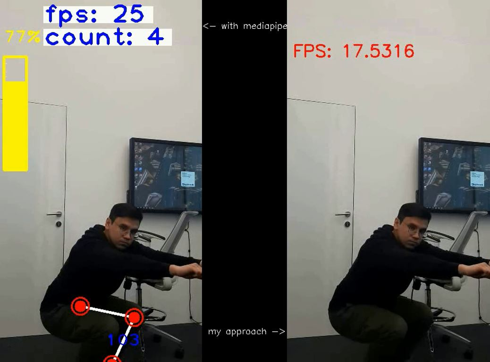

# The AI Fitness Trainer

The AI Fitness Trainer aims to provide a virtual fitness training experience by tracking and analyzing exercises using Computer Vision (CV). The expected value of integrating CV into fitness training is multifold:

Accuracy Improvement: By leveraging CV, we can significantly enhance the accuracy of exercise tracking, ensuring users perform exercises with correct posture and full range of motion for optimal benefits.

Feedback: Feedback can be provided on users' performance, assisting users in correcting their form immediately, much like a personal trainer.

Engagement and Motivation: A visual, interactive system can engage users more effectively, providing a simulated personal training experience that motivates consistent exercise.

Safety: Monitoring the correct form of exercises could help in preventing injuries which might occur due to incorrect posture or overexertion.

Dataset Description with Image Examples
The dataset for the Enhanced AI Fitness Trainer would consist of videos of people performing various exercises. This can be sourced from existing public datasets or created by recording and annotating exercises.

CV Methods and Detailed Explanation
We build upon the provided Python code that uses OpenCV for real-time pose tracking. Key Computer Vision methods that we plan to use include:

Pose Estimation with MediaPipe: Using the MediaPipe framework, we can detect human pose landmarks in real-time. It gives us 33 landmarks for a full body that will help us in calculating angles and positions of the body parts.

**What is MediaPipe Pose?**

MediaPipe Pose is a single-person pose estimation framework. It uses BlazePose 33 landmark topology. BlazePose is a superset of COCO keypoints, Blaze Palm, and Blaze Face topology. It works in two stages – detection and tracking. As detection is not performed in each frame, MediaPipe is able to perform inference faster. There are three models in MediaPipe for pose estimation.

- BlazePose GHUM Heavy
- BlazePose GHUM Full
- BlazePose GHUM Lite
These models are flagged as complexity 0, 1, and 2 respectively.

MediaPipe pose solution is also integrated with segmentation which can be switched just by passing a flag. Check out this article on MediaPipe Pose for more insight.

Angle Calculation for Exercise Form: We will calculate the angles between joints to identify the correct posture in exercises like pushups and squats. For instance, for a pushup, we would monitor the angles at the elbow and shoulder joints.

Interpolation for Range of Motion: Numpy's interpolation function will help to map the range of motion of an exercise to a scale (0-100%), giving immediate visual feedback on performance.

Threshold-based Counting Mechanism: The system establishes thresholds for the minimum and maximum range of an exercise to count reps. For example, in a pushup, the lowest point might be set at an arm angle of 90 degrees, and the full extension might correspond to 180 degrees. We will track when a full range of motion is made to count a rep.
